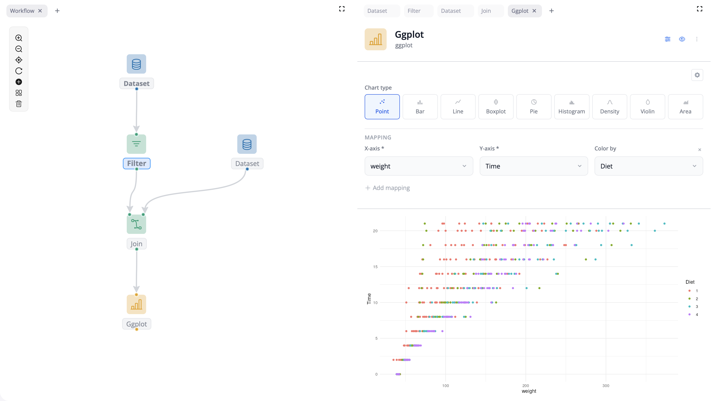

## Any shape you want {transition="slide-in none-out"}

{fig-align="center"}

::: {.caption}
Four separate colors, until you start building
:::

::: {.notes}
**Any shape you want — ~20 s** *(47 words)*

Play-doh. You can make any shape you want.

On the box of this kit there was a parrot — intricate, beautifully colored.
I could never get close.

That much freedom was always a burden to me, never a gift.

I was a lego kid, not an arts-and-crafts kid.
:::

## Limit the shape, define the interface {transition="none-in slide-out"}

::: columns
::: {.column width="50%"}

{fig-align="center"}

::: {.caption}
Re-formable, never reusable
:::

:::
::: {.column width="50%"}

{fig-align="center"}

::: {.caption}
Fixed shapes, endless reuse
:::

:::
:::

::: {.takeaway}
How do you make the next app cheaper than this one?
:::

::: {.notes}
**Limit the shape, define the interface — ~55 s** *(135 words)*

Restrictions and well-defined interfaces made me *more* creative, not less.

Lego costs you freedom — there are shapes you simply cannot build. What you get
back is reuse, and, oddly, more ideas: the shaping is already decided, so you
spend your attention on the model instead of on the material.

Much of this carries over to what we do. I work at a small consultancy, and we
have built a lot of Shiny apps over the years.

Every project felt like it needed tailor-made software, so we solved the same
problems again and again, and the code bases grew large and hard to change.
Clay, basically.

So: how do you make the next app cheaper than this one?

Well placed restrictions: Abstractions can feel like giving up expressiveness.
But they also buy you re-usability. They allow you to focus on what matters.
:::

## A block {transition="slide-in none-out"}

{fig-align="center"}

::: {.caption}
One step each, stacked into a pipeline
:::

::: {.takeaway}
**Data inputs. User parameters. One data output.**
:::

::: {.notes}
**A block — ~25 s** *(60 words)*

The core abstraction we built for blockr is a block: a well-defined unit of
computation.

You have data inputs, user parameters and a single output. That is the whole
contract.

That is what a stud gives you — a simple, well-defined interface.

*Optional, if the clock allows:* a Shiny module can have arbitrary inputs,
arbitrary outputs, side effects, and any communication channel you care to
invent. A block cannot, and that is the point.
:::

## A block {transition="none-in slide-out"}

```{.r code-line-numbers="|4|3|13|5-6|7-9"}
new_join_block <- function(by = character(), ...) {
  new_transform_block(
    function(id, x, y) {
      moduleServer(id, function(input, output, session) {
        cols <- reactive(intersect(names(x()), names(y())))
        observe(updateSelectInput("by", choices = cols()))
        code <- reactive(str2lang(glue::glue(
          'dplyr::left_join(x, y, by = "{input$by}")'
        )))
        list(expr = code, state = list(by = reactive(input$by)))
      })
    },
    function(id) selectInput(NS(id, "by"), "By", by),
    ...
  )
}
```

::: {.notes}
**A block, concretely — ~50 s** *(5 reveals, ~10 s each)*

**(4) Under the hood, it's a shiny module.

**(3) We have data inputs.** In this case there are two, `x` and `y`.

**(13) User parameters.** One dropdown — which column to join on. That is the
entire user surface of this block.

**(5-6) Some block-specific logic.** Whenever the input data changes we need
to re-compute which colums we can join on.

**(7-9) One data output.** The block does not return a table. It returns the
*line of R that makes one* — and you can read that line right there.
:::

## A small vocabulary {transition="slide"}

{fig-align="center"}

::: {.takeaway}
The tailoring lives in configuration — the code carries over.

Authoring becomes assembly.
:::

::: {.notes}
**Bridge — 35 s**

Small, well-scoped units of computation with a simple, stable API. So logic lives in
general-purpose blocks; the framework handles communication and reactivity.

The tailoring lives in configuration now, so the code carries over.

A board is a small vocabulary: blocks, and the links between them. That turns
authoring into assembly — and assembly doesn't take a big model.

*"The code carries over" is the sentence connecting complication to payoff — if it
takes more than one breath, you can't afford both ends of the argument.*

*Don't name the package: blockr.ai is on the way out, blockr.assistant on the way
in. "The assistant" stays true whichever has shipped.*
:::

## A real app {transition="slide-in none-out"}

::: {.placeholder}
[Video 1/3 — the app]{.ph-label}
A real, complex app we built. Opening section: what the app is and who uses it.
A few seconds, then it holds on the last frame so the next click advances.
:::

::: {.caption}
Built for a client, in production
:::

::: {.notes}
**Evidence — ~15 s**

A real, complex app we built.
:::

## A real app {transition="none"}

::: {.placeholder}
[Video 2/3 — general-purpose blocks]{.ph-label}
The board behind the app: almost entirely general-purpose blocks, the same ones we
use across very different projects. This is the central question answered, on
screen.
:::

::: {.caption}
The same blocks we use everywhere else
:::

::: {.notes}
**Evidence — ~20 s**

Almost entirely general-purpose blocks — the same ones we use across very different
projects.
:::

## A real app {transition="none-in slide-out"}

::: columns
::: {.column width="58%"}

::: {.placeholder}
[Video 3/3 — the one custom block]{.ph-label}
The single custom block, where the problem genuinely demanded it.
:::

:::
::: {.column width="42%"}

{fig-align="center"}

:::
:::

::: {.caption}
One custom block — lego ships specialty pieces too
:::

::: {.notes}
**Evidence — ~15 s**

One custom block, where the problem genuinely demanded it. Lego ships specialty
pieces too.

*The custom block is the point, not a footnote: it shows the abstraction holding AND
shows the escape hatch. That's the objection a skeptic is already forming.*

*Danger zone: this is where the "look how nice it is" pitch smuggles itself back in
and eats the clock.*
:::

## blockr {.center .closing}

Build a block.

::: {.takeaway}
Look out for what you *don't* have to decide.
:::

::: columns
::: {.column width="42%"}

```{r}
#| echo: false
#| fig-width: 2.4
#| fig-height: 2.4
qr_url <- "https://blockr.site"
plot(qrcode::qr_code(qr_url))
```

::: {.caption}
blockr.site
:::

:::
::: {.column width="58%"}

::: {.handles}
[\@DivadNojnarg](https://github.com/DivadNojnarg)

[\@christophsax](https://github.com/christophsax)

[\@nbenn](https://github.com/nbenn)

[\@MikeJohnPage](https://github.com/MikeJohnPage)
:::

:::
:::

::: {.notes}
**Ask + close — 30 s**

The assistant assembles. Someone still has to author the parts.

Your turn: build a block — with a **coding** assistant or without, however you
prefer. *(Say "coding assistant", not "assistant" — the line before is about the
board assistant and the two blur under one word.)*

And look out for what you *don't* have to decide — that's normally the expensive
part of making something reusable.

Testimony, honestly bounded: this worked for us. YMMV. *(First cut if the beat runs
long — the look-out-for line is already testimony, in the imperative.)*

**Landing:** that's the five minutes, and there's no Q&A. There's a lot more to
show, so come find me — I'm at this one on my own, and I'd rather talk to you than
to my laptop.

*A beat before the joke and none after. Land it and stop — no thank-you that steps
on it.*

*The slide is blockr, not you: it's what they photograph to act on later, while the
invitation to act now is in your voice. Confirm which URL is which — the labels are
bare because blockr.cloud and blockr.site aren't referenced in the repos.*
:::
