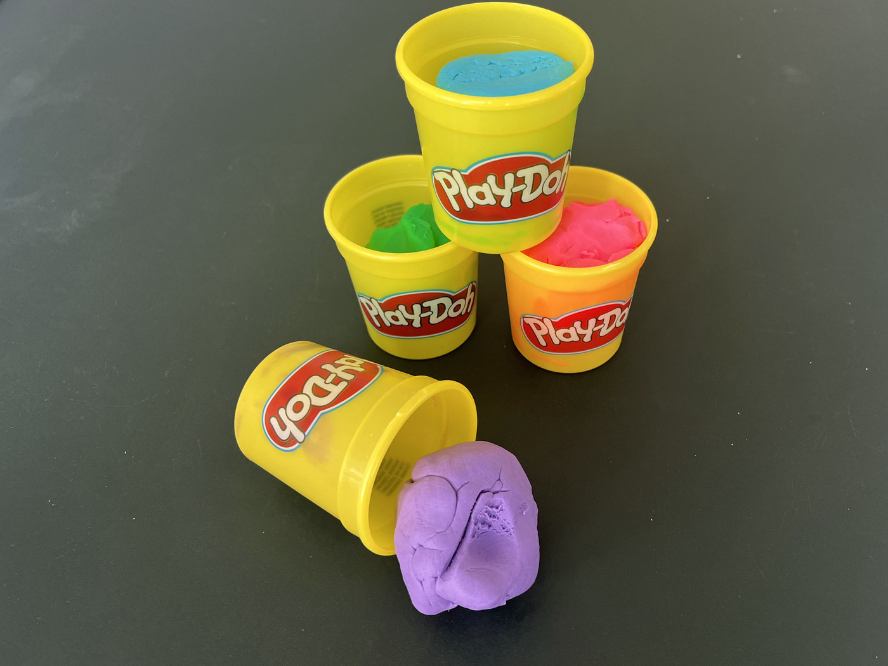
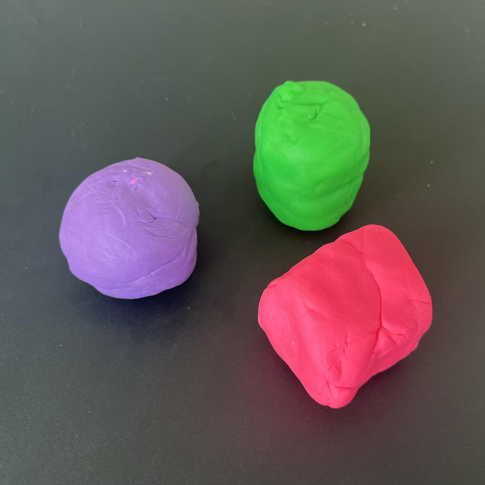
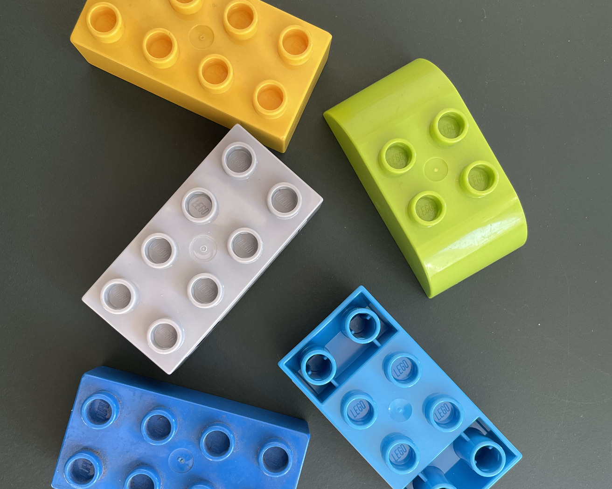
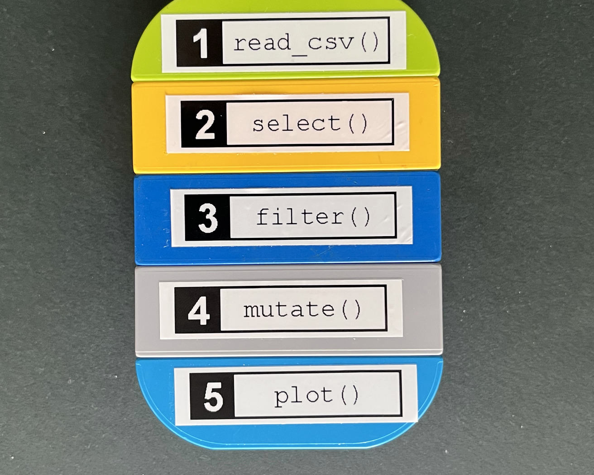
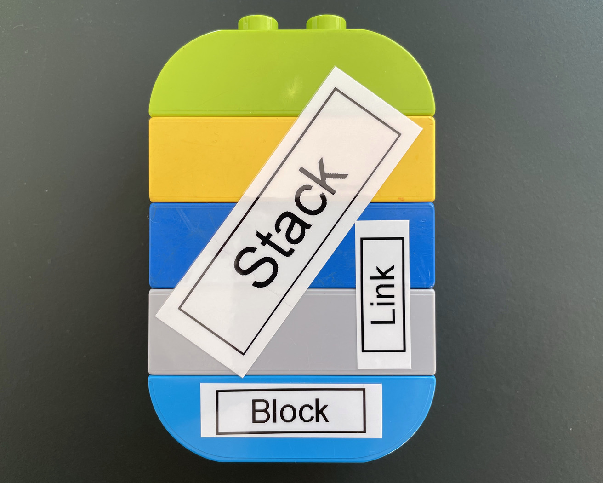
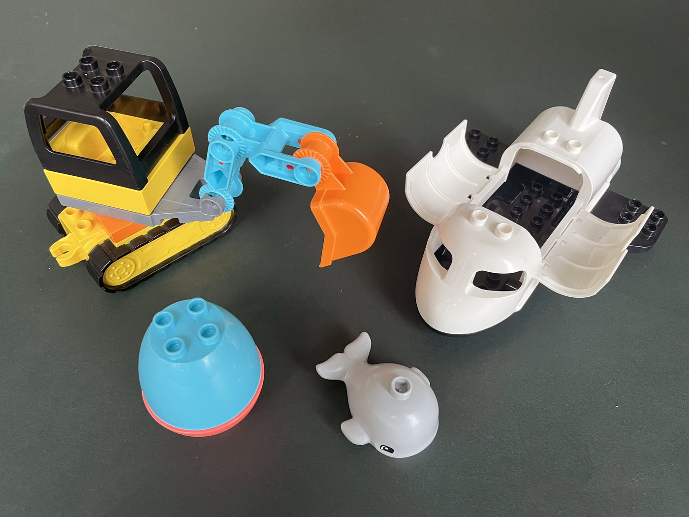

## Any shape you want {transition="slide-in none-out"}

{fig-align="center"}

::: {.takeaway}
Total freedom, but little help
:::

::: {.notes}
<!-- Any shape you want — ~17 s (40 words) -->

Play-doh. It's a fun toy: you can create any shape you want with it.

To me personally though, that much freedom always felt more like a burden. You
don't get much assistance from the material.

I gravitated more towards lego.
:::

## What carries over to your next app? {.pair transition="none-in slide-out"}

::: columns
::: {.column width="50%"}

{fig-align="center"}

::: {.caption}
Assembly is up to you
:::

:::
::: {.column width="50%"}

{fig-align="center"}

::: {.caption}
Assembly is built in
:::

:::
:::

::: {.takeaway}
Limit the shape, define the interface
:::

::: {.notes}
<!-- What carries over to your next app? — ~72 s (175 words) -->

Restrictions and well-defined interfaces helped me be *more* creative.

Two lumps of play-doh assemble however you press them together. Assembly of two
bricks on the other hand is mediated by studs.

On the surface, lego costs you freedom. There are shapes you simply cannot
build. What you get back is reuse, and with shaping constraints, you can spend
your attention on the model instead of the material.

Much of this applies to what we do. I work at a small consultancy, and we
have built a lot of Shiny apps over the years.

Every project felt like it needed to be tailor-made, so we ended up solving
similar problems over and over again. Code bases grew large and hard to change.
Clay, basically.

How can we improve? How can we have components carry over from one app to the
next?

One way is by imposing restrictions. If we limit the shape by defining an
interface, this enables reuse. It lets you focus on what matters. And it applies
to humans and current-gen coding assistants alike.
:::

## A block {.pair transition="slide-in none-out"}

::: columns
::: {.column width="50%"}

{fig-align="center"}

::: {.caption}
One step each, stacked into a pipeline
:::

:::
::: {.column width="50%"}

{fig-align="center"}

::: {.caption}
Brick, stud, model
:::

:::
:::

::: {.takeaway}
Data inputs. User parameters. One data output.
:::

::: {.notes}
<!-- A block — ~27 s (66 words) -->

The core abstraction we built for blockr is a block: a well-defined unit of
computation.

Blocks are connected by links and can be assembled into stacks.

Each block has data inputs, user parameters and a single output. That is the
whole contract.

The block is the brick, the link is the stud and the stack is the model. The
stud is our interface: simple and well-defined.
:::

## A block {transition="none-in slide-out"}

```{.r code-line-numbers="|4|3|13|5-6|7-9"}
new_join_block <- function(by = character(), ...) {
  new_transform_block(
    function(id, x, y) {
      moduleServer(id, function(input, output, session) {
        cols <- reactive(intersect(names(x()), names(y())))
        observe(updateSelectInput("by", choices = cols()))
        code <- reactive(str2lang(glue::glue(
          'dplyr::left_join(x, y, by = "{input$by}")'
        )))
        list(expr = code, state = list(by = reactive(input$by)))
      })
    },
    function(id) selectInput(NS(id, "by"), "By", by),
    ...
  )
}
```

::: {.notes}
<!-- A block, concretely — ~50 s (5 reveals, ~10 s each) -->

Let's make it a bit more concrete: this is how you could write a join block.

**(4) Under the hood, it's a shiny module.**

**(3) Here we have our data inputs:** `x` and `y`.

**(13) Next are user parameters:** We need a dropdown to select the column to
join on.

**(5-6) We might need some logic too:** Whenever the input data
changes we need to re-compute which columns we can join on.

**(7-9) Taken together, this produces data output.** We return an interpolated
expression. So we can calculate the result given data inputs on demand.
:::

## A real app {transition="slide"}

<div class="app-shot">

<span class="hl hl-board fragment fade-in-then-out"></span>
<span class="hl hl-assistant fragment fade-in-then-out"></span>
<span class="hl hl-profile fragment fade-in-then-out"></span>
</div>

::: {.takeaway}
Bristol-Myers Squibb: up to 100 blocks across a dozen views, one created
specifically for this use case.
:::

::: {.notes}
<!-- A real app — ~52 s (126 words) -->

We are using blockr at Bristol-Myers Squibb to explore clinical data from
studies.

Our frontend here is built on a docking layout manager and we have every block
render a panel you can move and resize freely.

These apps pull in up to one hundred blocks, spread over a dozen views. And
we're rolling out many such apps, specific to studies and their analysis needs.

Blocks are not the only extension point. There are *extensions* as well: on
the left, we have a graphical overview of the board and on the right, an AI
assistant.

Most blocks here are general purpose: reading data, transforming it, displaying
summary tables and visualizations that support drill-down. But one block was
built specifically for this use case: the patient profile.
:::

## Specialty pieces {transition="slide"}

{fig-align="center"}

::: {.takeaway}
Special shape, standard stud.
:::

::: {.notes}
<!-- Specialty pieces — ~22 s (53 words) -->

Our current library of general-purpose blocks cannot cover every use case.

Similar to specialty pieces that come with certain lego sets, sometimes you
want a specific shape, which still comes with the standard studs.

We made it easy for you to do just that by integrating your own blocks into
a blockr app.
:::

## Build a block. {.closing}

::: {.takeaway}
Look out for what you *don't* have to decide.
:::

```{r}
#| echo: false
#| fig-width: 2.4
#| fig-height: 2.4
plot(qrcode::qr_code("https://blockr.site"))
```

::: {.meta}
blockr.site
:::

::: {.credits}
[\@christophsax](https://github.com/christophsax) ·
[\@DivadNojnarg](https://github.com/DivadNojnarg) ·
[\@nbenn](https://github.com/nbenn) ·
[\@olajoke](https://github.com/olajoke) ·
[\@MikeJohnPage](https://github.com/MikeJohnPage)
:::

::: {.notes}
<!-- Ask + close — ~32 s (78 words) -->

Now it's your turn: build a block. Either by hand, or by pointing a coding
assistant at the many examples we have created.

And look out for what you *don't* have to decide. That's normally the expensive
part of making something reusable.

I'd like to thank my four collaborators for their contributions -- and you for
your attention.

Unfortunately we don't get a Q&A. If you have questions for me, want to see or
hear more, come find me.
:::
