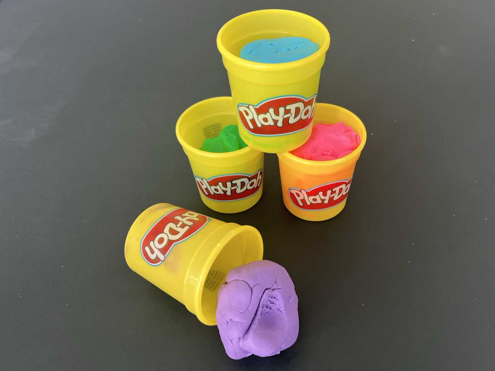
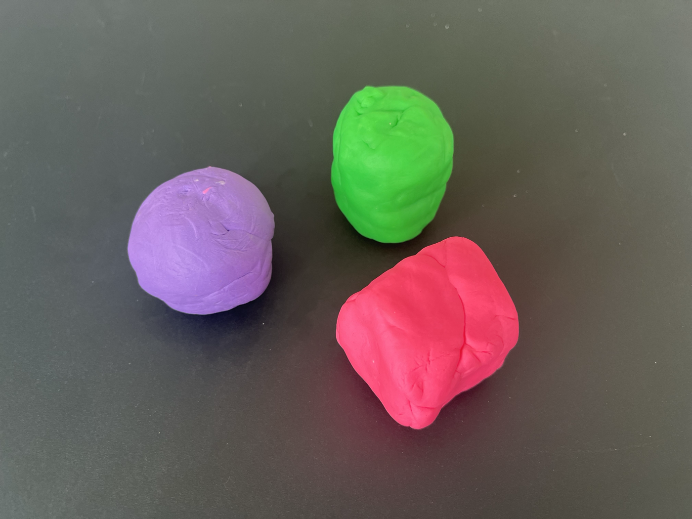
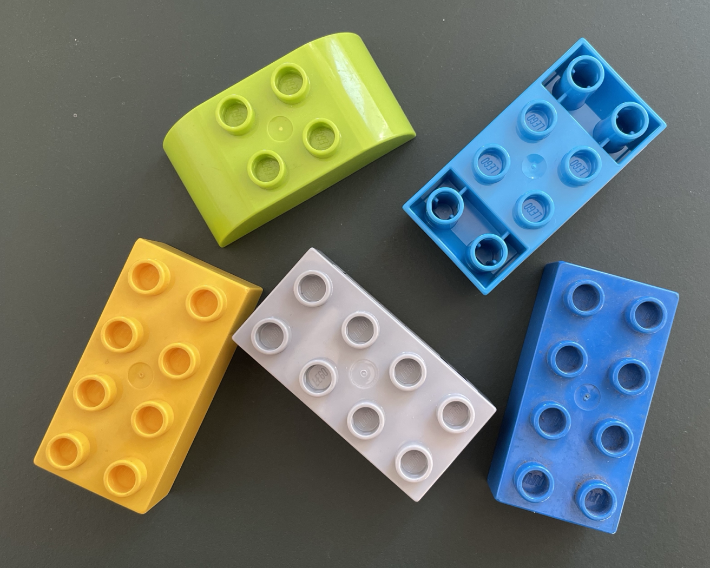
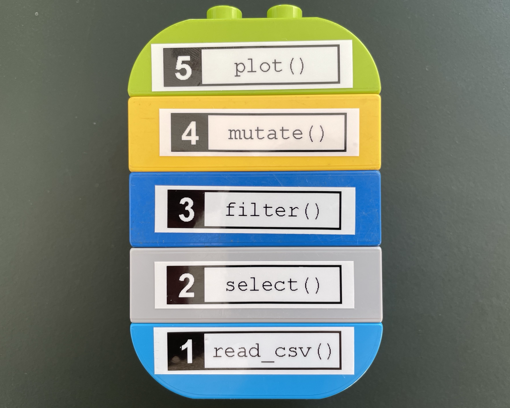
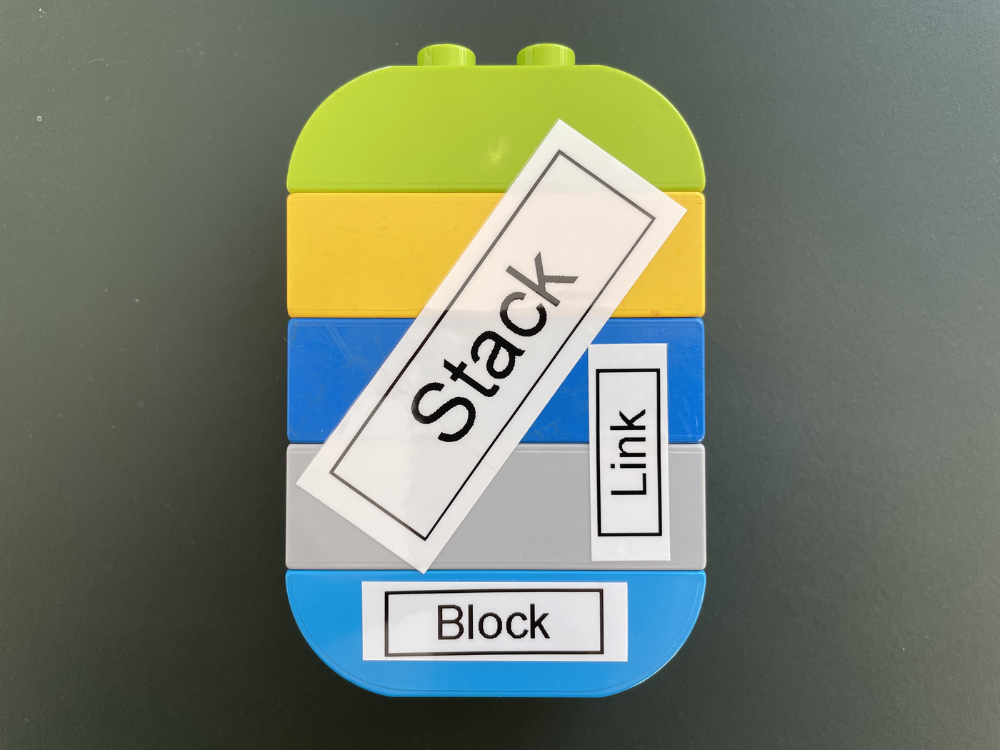
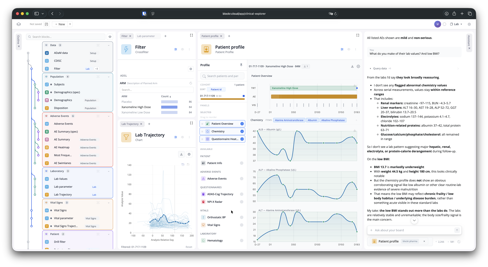
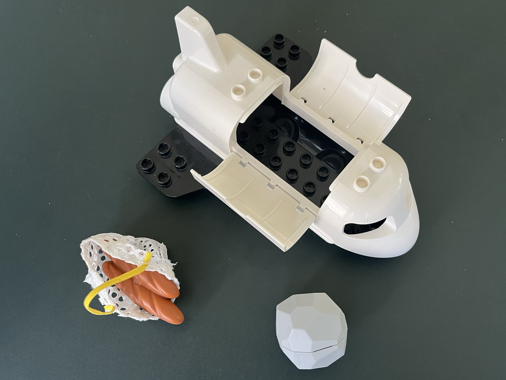

## Any shape you want {transition="slide-in none-out"}

{fig-align="center"}

::: {.caption}
Anything is possible, nothing is provided
:::

::: {.notes}
**Any shape you want — ~20 s** *(47 words)*

Play-doh. You can make any shape you want.

On the box of this kit there was a parrot — intricate, beautifully colored.
I could never get close.

That much freedom was always a burden to me, never a gift.

I was a lego kid, not an arts-and-crafts kid.
:::

## Limit the shape, define the interface {.pair transition="none-in slide-out"}

::: columns
::: {.column width="50%"}

{fig-align="center"}

::: {.caption}
Mix them and they stay mixed
:::

:::
::: {.column width="50%"}

{fig-align="center"}

::: {.caption}
Stack them and they come apart
:::

:::
:::

::: {.takeaway}
How do you make the next app cheaper than this one?
:::

::: {.notes}
**Limit the shape, define the interface — ~55 s** *(135 words)*

Restrictions and well-defined interfaces made me *more* creative, not less.

Lego costs you freedom — there are shapes you simply cannot build. What you get
back is reuse, and, oddly, more ideas: the shaping is already decided, so you
spend your attention on the model instead of on the material.

Much of this carries over to what we do. I work at a small consultancy, and we
have built a lot of Shiny apps over the years.

Every project felt like it needed tailor-made software, so we solved the same
problems again and again, and the code bases grew large and hard to change.
Clay, basically.

So: how do you make the next app cheaper than this one?

Well placed restrictions: Abstractions can feel like giving up expressiveness.
But they also buy you re-usability. They allow you to focus on what matters.
And this applies to humans as well as current-gen coding assistants.
:::

## A block {.pair transition="slide-in none-out"}

::: columns
::: {.column width="50%"}

{fig-align="center"}

::: {.caption}
One step each, stacked into a pipeline
:::

:::
::: {.column width="50%"}

{fig-align="center"}

::: {.caption}
Block, link, stack — the whole vocabulary
:::

:::
:::

::: {.takeaway}
Data inputs. User parameters. One data output.
:::

::: {.notes}
**A block — ~25 s** *(60 words)*

The core abstraction we built for blockr is a block: a well-defined unit of
computation.

You have data inputs, user parameters and a single output. That is the whole
contract.

That is what a stud gives you — a simple, well-defined interface.

*Optional, if the clock allows:* a Shiny module can have arbitrary inputs,
arbitrary outputs, side effects, and any communication channel you care to
invent. A block cannot, and that is the point.
:::

## A block {transition="none-in slide-out"}

```{.r code-line-numbers="|4|3|13|5-6|7-9"}
new_join_block <- function(by = character(), ...) {
  new_transform_block(
    function(id, x, y) {
      moduleServer(id, function(input, output, session) {
        cols <- reactive(intersect(names(x()), names(y())))
        observe(updateSelectInput("by", choices = cols()))
        code <- reactive(str2lang(glue::glue(
          'dplyr::left_join(x, y, by = "{input$by}")'
        )))
        list(expr = code, state = list(by = reactive(input$by)))
      })
    },
    function(id) selectInput(NS(id, "by"), "By", by),
    ...
  )
}
```

::: {.notes}
**A block, concretely — ~50 s** *(5 reveals, ~10 s each)*

**(4) It's a shiny module.**

**(3) We have data inputs.** In this case there are two, `x` and `y`.

**(13) User parameters.** One dropdown — which column to join on. That is the
entire user surface of this block.

**(5-6) Some block-specific logic.** Whenever the input data changes we need
to re-compute which columns we can join on.

**(7-9) One data output.** The block does not return a table. It returns the
*line of R that makes one* — and you can read that line right there.
:::

## A real app {transition="slide"}

{fig-align="center"}

::: {.takeaway}
Bristol-Myers Squibb: roughly 100 blocks across a dozen views, only one created
specifically for this app.
:::

::: {.notes}
**A real app — ~45 s** *(105 words)*

We are using blockr at Bristol-Myers Squibb to explore clinical data from
studies.

Our standard frontend is built on a docking layout manager: every block renders
in a panel you can move and resize freely.

These apps run to roughly a hundred blocks, spread over a dozen views.

Blocks are not the only extension point. There are *extensions* as well — on the
left, a graphical overview of the board; on the right, an AI assistant.

Most of those blocks are general purpose: reading data, transforming it, simple
visualizations, summary tables. One was built specifically for these apps — the
patient explorer.
:::

## Specialty pieces {transition="slide"}

{fig-align="center"}

::: {.caption}
Some pieces ship with the set. Some you bring yourself.
:::

::: {.notes}
**Specialty pieces — ~20 s** *(52 words)*

We have been building out a library of general-purpose blocks.

As we have just seen, that will not cover every use case.

And as with the specialty pieces that come with certain lego sets, we have tried
to make it as easy as we can to drop your own logic into a blockr app.

*This is the objection a skeptic is already forming. Answering it out loud is
what buys the ask on the next slide.*
:::

## blockr {.center .closing}

Build a block.

::: {.takeaway}
Look out for what you *don't* have to decide.
:::

::: columns
::: {.column width="42%"}

```{r}
#| echo: false
#| fig-width: 2.4
#| fig-height: 2.4
qr_url <- "https://blockr.site"
plot(qrcode::qr_code(qr_url))
```

::: {.caption}
blockr.site
:::

:::
::: {.column width="58%"}

::: {.handles}
[\@DivadNojnarg](https://github.com/DivadNojnarg)

[\@christophsax](https://github.com/christophsax)

[\@nbenn](https://github.com/nbenn)

[\@MikeJohnPage](https://github.com/MikeJohnPage)
:::

:::
:::

::: {.notes}
**Ask + close — ~35 s** *(82 words)*

Your turn: build a block. Either by hand, or point a **coding** assistant at the
many examples we have built and see what comes out. *(Say "coding assistant",
not "assistant" — the line before is about the board assistant and the two blur
under one word.)*

And look out for what you *don't* have to decide — that's normally the expensive
part of making something reusable.

That's the five minutes, and there's no Q&A. So if you have questions, or want
to see more, come find me — I came on my own, and I would much rather talk to
you than to my laptop.
:::
